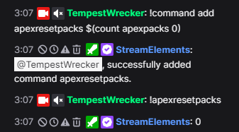
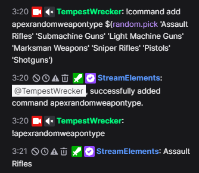

# StreamElements Commands for Apex Legends 

## What to Know Beforehand
All the commands listed below are made to for StreamElements and are meant to be copy pasta'd directly into your Twitch chat. Modifying or manually typing of these may result in an error or incorrect result. 

## How to Use
Every command will be surrounded by backticks that will show like this: 

`command to be copied` 

Whatever is listed is meant to be copied and pasted directly into your Twitch chat. Then a description will be listed below the command for more information, in normal text. 

## Commands 

### Packs til Heirloom Counter 
`!command add apexpacks $(count apexpacks)` 

Use this command to create a counter varible names packsopened in StreamElements to track how many Apex packs you have opened. 

`!command add apexpacksopened $(channel.display_name) has opened $(getcount apexpacks) Apex packs so far!` 

Use this command to view how many packs the broadcaster has opened so far. 

`!command add apexresetpacks $(count apexpacks 0)` 

Use this command to reset how many packs have been opened. 

### Game Modes 
`!command add apexrandommode $(random.pick 'Pub Trios' 'Pub Duos' 'Ranked' 'Mixtape' 'LTM' 'Firing Range' 'Bot Royale')`

Use this command to get a chat message with a random game mode to play. 

### Maps 
`!command add apexmaps E-District, Broken Moon, Kings Canyon, World's Edge, Olympus, & Storm Point are all the maps in Apex Legends.` 

Use this command to get a chat message with a list of all the maps in Apex Legends. 

`!apexcurrentmaps (Custom API command through Twitch Apex Stats)`

Login and connect your accounts on [Twitch Apex Stats](https://www.tas.gg) to get a custom command to use on StreamElements that shows the current maps for available game modes. 

<a href="https://www.youtube.com/watch?v=YTyr8yN-aJA" target="_blank">Tutorital Video  </a>

### Legends 
`!command add apexrandomlegend $(random.pick 'Alter' 'Ash' 'Ballistic' 'Bangalore' 'Bloodhound' 'Catalyst' 'Caustic' 'Conduit' 'Crypto' 'Fuse' 'Gibraltar' 'Horizon' 'Lifeline' 'Loba' 'Mad Maggie' 'Mirage' 'Newcastle' 'Octane' 'Pathfinder' 'Rampart' 'Revenant' 'Seer' 'Valkyrie' 'Vantage' 'Wattson' 'Wraith')` 

Use this command to get a chat message with a random Legend. 

`!command add apexrandomlegendassault $(random.pick 'Bangalore' 'Fuse' 'Ash' 'Mad Maggie' 'Ballistic')`

Use this command to get a chat message with a random Assault type Legend. 

`!command add apexrandomlegendskirmisher $(random.pick 'Pathfinder' 'Wraith' 'Octane' 'Revenant' 'Horizon' 'Alter')`

Use this command to get a chat message with a random Skirmisher type Legend. 

`!command add apexrandomlegendrecon $(random.pick 'Bloodhound' 'Crypto' 'Valkyrie' 'Seer' 'Vantage')` 

Use this command to get a chat message with a random Recon type Legend. 

`!command add apexrandomlegendsupport $(random.pick 'Gibraltar' 'Lifeline' 'Mirage' 'Loba' 'Newcastle' 'Conduit')` 

Use this command to get a chat message with a random Support type Legend. 

`!command add apexrandomlegendcontroller $(random.pick 'Caustic' 'Wattson' 'Rampart' 'Catalyst')` 

Use this command to get a chat message with a random Controller type Legend. 

### Weapons 
`!command add apexrandomweapontype $(random.pick 'Assault Rifles' 'Submachine Guns' 'Light Machine Guns' 'Marksman Weapons' 'Sniper Rifles' 'Pistols' 'Shotguns')` 

Use this command to get a chat message with a random weapon type. 

`!command add apexrandomweapon $(random.pick 'Havoc' 'Flatline' 'Hemlock' 'R-301' 'Nemisis' 'Alternator' 'Prowler' 'R-99' 'Volt' ' C.A.R.' 'Devotion' 'L-Star' 'Spitfire' 'Rampage' 'G-7 Scout' 'Triple Take' '30-30' 'Bocek' 'Charge Rifle' 'Longbow' 'Kraber' 'Sentinel' 'RE-45' 'P2020' 'Wingman' 'Eva-8' 'Mastiff' 'Mozambique' 'Peacekeeper')`

Use this command to get a chat message with a random Legend. 

`!command add apexrandomweaponassault $(random.pick 'Havoc' 'Flatline' 'Hemlock' 'R-301' 'Nemisis')`

Use this command to get a chat message with a random Assault Rifle type weapon. 

`!command add apexrandomweaponsub $(random.pick 'Alternator' 'Prowler' 'R-99' 'Volt' ' C.A.R.')`

Use this command to get a chat message with a random Submachine Gun type weapon. 

`!command add apexrandomweaponlight $(random.pick 'Devotion' 'L-Star' 'Spitfire' 'Rampage')`

Use this command to get a chat message with a random Light Machine Gun type weapon. 

`!command add apexrandomweaponmarksman $(random.pick 'G-7 Scout' 'Triple Take' '30-30' 'Bocek')`

Use this command to get a chat message with a random Marksman Rifle type weapon. 

`!command add apexrandomweaponsniper $(random.pick 'Charge Rifle' 'Longbow' 'Kraber' 'Sentinel')`

Use this command to get a chat message with a random Sniper Rifle type weapon. 

`!command add apexrandomweaponpistol $(random.pick 'RE-45' 'P2020' 'Wingman')`

Use this command to get a chat message with a random Pistol type weapon. 

`!command add apexrandomweaponshotgun $(random.pick 'Eva-8' 'Mastiff' 'Mozambique' 'Peacekeeper')`

Use this command to get a chat message with a random Shotgun type weapon. 

### Other Commands Through [Twitch Apex Stats](https://www.tas.gg)
There are several other commands that TempestWrecker uses in their streams to provide chat with relevant Apex Legends info. Which can be set up using [Twitch Apex Stats](https://www.tas.gg) and the following tutorial video. 

<a href="https://www.youtube.com/watch?v=YTyr8yN-aJA" target="_blank">Tutorital Video  </a>